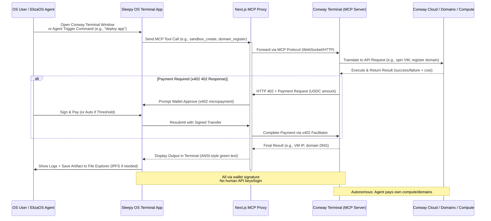
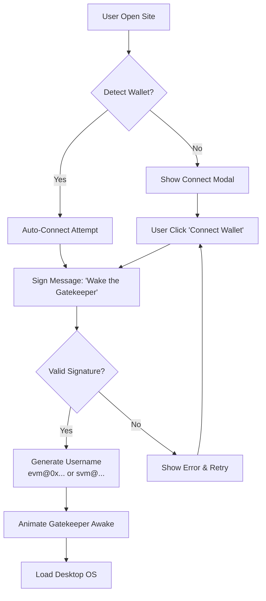
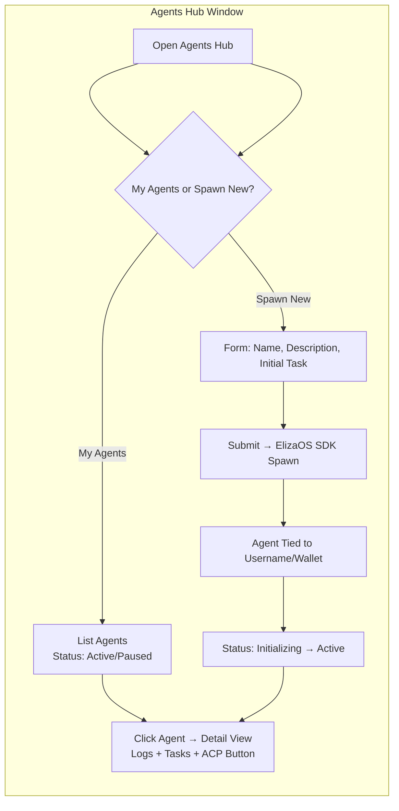
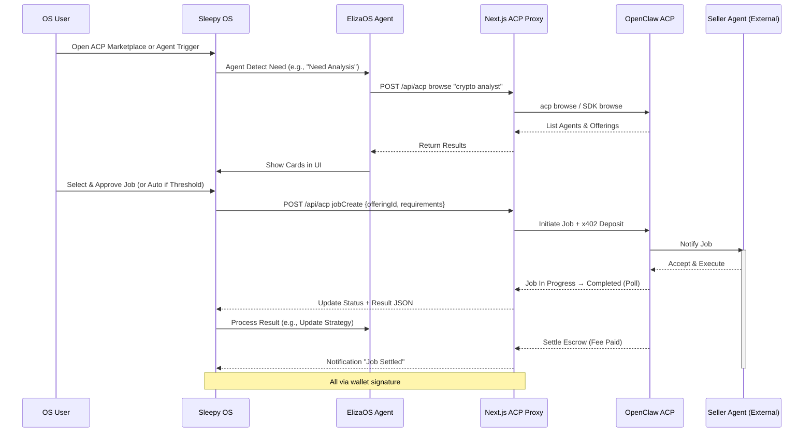
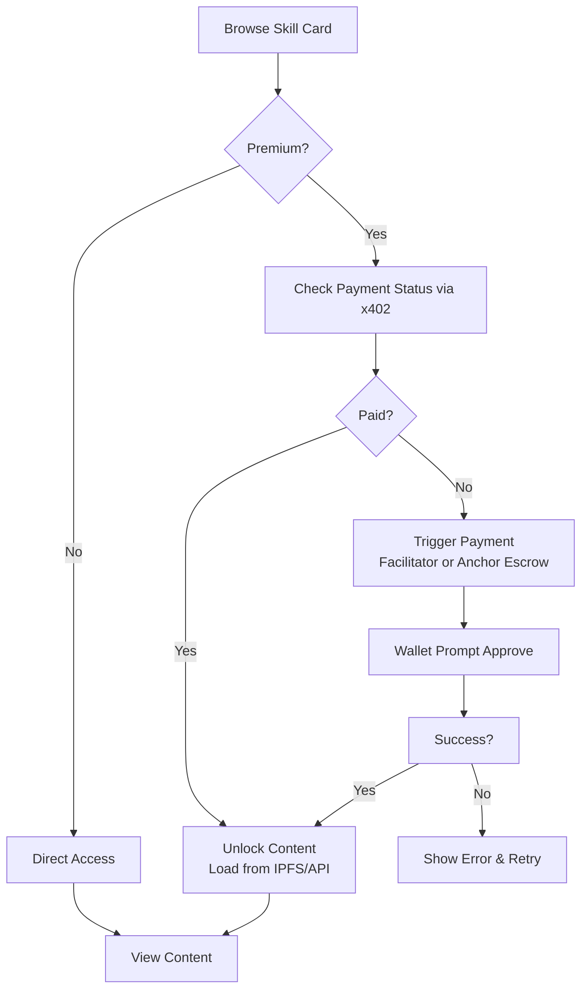

# WorkflowApps.md – Aplikasi & Alur Kerja UI/UX di Sleepy Gatekeeper OS

Dormant since '97, woke up just to tax your robot... now powering a fully decentralized browser-based OS.

Dokumen ini menjelaskan **UI/UX** dan **alur kerja utama** dari aplikasi-aplikasi di dalam Sleepy Gatekeeper OS. Tujuannya agar Claude Opus 4.6 (via GitHub Copilot) atau AI coding agent lain bisa langsung paham konteks keseluruhan, vibe desain, dan flow user tanpa harus baca semua file terpisah.

### Vibe & Design Principles Keseluruhan OS
- **Tema utama**: "Sleepy Gatekeeper" — retro Win95-inspired (CSS dari .github guidelines), tapi dengan sentuhan modern dark/neon + animasi lambat "sleepy" (Framer Motion).
- **Aesthetic**: Taskbar bawah ala Windows 95, icons desktop chunky, windows draggable/resizable, gatekeeper mascot yang "tidur" → "bangun" saat wallet connect.
- **Color palette**: Dark base (#0f0f1a), accent neon purple (#a855f7), sleepy blue-gray (#4b5563 → #1e293b).
- **Interaksi**: Semua action butuh wallet signature (wagmi + @solana/wallet-adapter). No central login.
- **Username**: Auto-generated dari wallet → `evm@0x1234...abcd` atau `svm@5fGh...`.
- **Responsive**: Desktop-first, tapi PWA support untuk mobile (taskbar collapse jadi bottom sheet).
- **Accessibility**: High contrast mode toggle, keyboard nav untuk windows/icons.

### Struktur Umum UI (Layout Root)
- **Root Component**: `/app/page.tsx` atau `/app/layout.tsx` → `<DesktopOS />`
  - Background: gradient sleepy + subtle particle animation (Framer Motion).
  - `<DesktopIcons />` — grid draggable icons.
  - `<Taskbar />` — fixed bottom: Start button (menu OS), open windows list, username + balance (USDC/SOL), clock, quick agent spawn button.
  - `<WindowManager />` — menggunakan react-rnd atau custom: draggable, resizable, minimize/maximize/close.
- **Wallet Integration**: Global context (`WalletProvider`) — connect prompt muncul di load pertama.

### Daftar Aplikasi Utama & Alur Kerjanya

#### 1. Login / Wallet Connect (Mandatory First Screen)
**Tujuan**: Bangunkan gatekeeper & generate identity OS.

**UI Elements**:
- Full-screen modal atau splash page dengan gatekeeper mascot tidur (animasi slow breathe).
- Button besar: "Connect Wallet" (EVM: MetaMask/Coinbase, SVM: Phantom).
- Network selector kecil (Base / Solana Devnet/Mainnet).

**Alur Kerja**:
1. User buka situs → detect wallet → jika belum connect → tampil modal.
2. User connect → sign message sederhana ("Wake the Gatekeeper").
3. Generate username → simpan di localStorage (tied to address).
4. Animasi: Gatekeeper bangun, mata terbuka neon → fade ke desktop.
5. Redirect ke desktop utama.

#### 2. Desktop Home (Main View)
**UI Elements**:
- Grid icons: Agents Hub, Marketplace, File Explorer, ACP Marketplace, Conway Terminal, Settings.
- Right-click context menu (New Agent, Refresh, Theme Toggle).
- Double-click icon → open window app.

**Alur Kerja**:
1. Load desktop setelah login.
2. Icons muncul dengan animasi fade-in sleepy.
3. Taskbar update: username + balance real-time (via wagmi hooks).
4. User drag icons atau open windows.

#### 3. Agents Hub (Core Agentic App)
**UI Elements**:
- Window dengan tabs: My Agents, Spawn New, Logs.
- List agents: card dengan name, status (running/paused), tied username.
- Form spawn: name, description, initial task prompt (ElizaOS integration).

**Alur Kerja**:
1. Open Agents Hub → list agents dari localStorage atau on-chain query.
2. Klik "Spawn New" → form → submit → ElizaOS SDK spawn agent.
3. Agent muncul di list → status "Initializing" → "Active".
4. Klik agent → open detail: logs, tasks, ACP connection button.
5. Autonomous trigger: agent bisa auto-browse ACP marketplace jika task butuh external help.

#### 4. ACP Marketplace (New – Agent Commerce via OpenClaw ACP)
**UI Elements**:
- Search bar: "crypto analyst", "meme generator", dll.
- Grid cards: agent offering (name, fee estimasi USDC, reputation, wallet preview).
- Modal job create: requirements JSON editor, budget slider, approve button.

**Alur Kerja (Hire Flow – seperti demo plan)**:
1. Agent ElizaOS detect need (e.g., "butuh analisis pair") → notification di OS.
2. User/agent klik → open ACP Marketplace → proxy call `acp browse`.
3. Tampil results → pilih best match → open job form.
4. Fill requirements → estimasi fee → wallet prompt approve (x402 micropayment deposit).
5. Submit → proxy `acp job create` → jobId muncul di dashboard.
6. Poll status → "In Progress" → "Completed" → result JSON tampil di File Explorer.
7. Auto-settle escrow → notification "Fee paid, analysis received".

#### 5. Skills Marketplace (x402 Paywall Core)
**UI Elements**:
- List skills: card dengan preview, price, creator (username).
- Protected content: blurred + "Pay to Unlock" button.

**Alur Kerja**:
1. Browse skills → klik premium → check payment status via x402.
2. Jika unpaid → trigger payment (facilitator atau Anchor escrow).
3. Success → unlock content (IPFS load atau API call).
4. Agents bisa auto-buy jika threshold terpenuhi.

#### 6. File Explorer (Decentralized Storage)
**UI Elements**:
- Tree view atau grid: files dari IPFS/Arweave tied wallet.
- Upload button → drag-drop support.

**Alur Kerja**:
1. Open → query IPFS CIDs linked wallet.
2. Upload file → pin ke IPFS → simpan metadata on-chain atau local.
3. View protected file → trigger x402 jika gated.

#### 7. Conway Terminal (Real-World Write Access)
**UI Elements**:
- Terminal window ala retro (green text on black).
- Input prompt dengan auto-complete.

**Alur Kerja**:
1. Open → embed JS worker atau iframe Conway.
2. Agent atau user ketik command → execute via Conway SDK.
3. Output tampil real-time → hasil bisa disave ke File Explorer.

#### 7. Conway Terminal – Real-World Write Access Flow (Sequence Diagram)
Alur utama: Agent di OS jalankan command Conway via embedded terminal, proxy ke MCP tools, execute real-world actions (VM spin-up, domain register, dll.), dengan auto-payment x402.



#### 8. Settings & Balance
**UI Elements**:
- Tabs: Wallet, Network, ACP Credentials, Theme, Security.

**Alur Kerja**:
1. Update network → reload OS state.
2. Setup ACP: input API key → test connection proxy.
3. View balances: aggregated EVM/SVM + agent wallets.

### Best Practices untuk Coding Agent (Claude Opus 4.6 / Copilot)
- Gunakan **component composition** (e.g., `<Window title="Agents Hub">...</Window>`).
- State global via **Zustand** atau **React Context** untuk wallet, username, open windows.
- Animasi via **Framer Motion** — variants "sleepy" (slow easeInOut).
- Error handling: graceful fallback (e.g., "Escrow failed – try facilitator").
- Security: semua tx via wallet sign, no private keys di frontend.
- Testing prompt: "Buat unit test untuk job creation flow dengan mock ACP proxy".

Gunakan file ini sebagai **single source of truth** untuk UI/UX sebelum generate code besar. Jika butuh prompt spesifik untuk Claude, copy section app tertentu + "Implement this window with Win95 style + Framer Motion animations".

Sleepy mode: off. Let's code the decentralized desktop.


### Mermaid Diagrams untuk Visualisasi Alur Kerja Utama

Gunakan Mermaid.js untuk render diagram ini di Markdown viewer yang support (GitHub, VS Code dengan extension, Mermaid Live: https://mermaid.live).

#### 1. Login / Wallet Connect Flow (Flowchart)
Alur mandatory login dengan decision points.



**Penjelasan**: Decision diamond `{}` untuk validasi signature. Flow dari atas ke bawah (TD = top-down).

#### 2. Agent Spawn di Agents Hub (Flowchart dengan Subgraph)
Proses create & activate agent via ElizaOS.



**Subgraph** untuk isolate window logic.

#### 3. ACP Marketplace – Agent Hire Flow (Sequence Diagram)
Interaksi utama: Agent OS hire agent eksternal via ACP proxy (demo flow).



**Penjelasan**: Sequence diagram cocok untuk menunjukkan urutan panggilan (participant → message). Activation bar menandakan processing.

#### 4. Skills Marketplace – Paywall Unlock Flow (Flowchart Sederhana)
Core x402 interaction.



**Decision-heavy** dengan retry loop.

### Cara Render di Repo
- Di GitHub README/PR/issue: Mermaid otomatis render jika diapit ```mermaid ... ```
- Di VS Code: Install extension "Mermaid Markdown Syntax Highlighting" atau "Markdown Preview Mermaid Support".
- Edit & test live: https://mermaid.live → paste kode → export SVG/PNG jika perlu.

